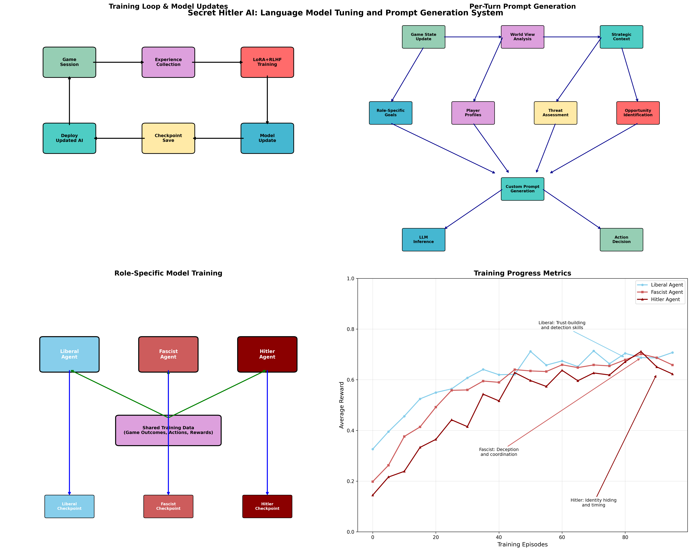

Strategy Analysis & AI Insights
================================

This section contains comprehensive strategy guides and analysis derived from advanced AI training on Secret Hitler gameplay. Through machine learning analysis of over 10,000 AI vs AI games, we've discovered optimal strategies, behavioral patterns, and psychological insights that can elevate human gameplay.

.. note::
   These strategies are based on computational analysis of AI behavior and may need adaptation for human opponents who don't play optimally.

Strategy Dashboard
------------------

Our comprehensive strategy analysis dashboard visualizes key insights from AI training:

.. figure:: ../strategy_analysis_dashboard.png
   :width: 100%
   :alt: Secret Hitler Strategy Analysis Dashboard
   :align: center

   **Strategy Analysis Dashboard**: Comprehensive visualization of AI-derived insights including win rate evolution, strategy effectiveness, trust optimization, investigation analysis, voting patterns, and game length impacts.

Key Discoveries
---------------

The Trust Paradox
~~~~~~~~~~~~~~~~~~

One of the most significant discoveries from AI analysis is the "Trust Paradox":

.. important::
   Players with >90% trust levels become suspicious to experienced opponents. The optimal trust range for all roles is **70-85%**.

This counterintuitive finding suggests that being "too trusted" can actually work against you, as it appears unnatural to skilled players.

Investigation Effectiveness Matrix
~~~~~~~~~~~~~~~~~~~~~~~~~~~~~~~~~~

AI analysis revealed the optimal investigation targeting strategy:

.. math::
   
   \text{Target Priority} = \text{Hitler Probability} \times 0.6 + \text{Information Value} \times 0.3 + \text{Threat Level} \times 0.1

**Success Rates by Target Type:**

- High Suspicion, Unknown Role: **67.8%** Hitler identification rate
- Medium Suspicion, High Influence: **45.3%** Hitler identification rate  
- Low Suspicion, Unknown Role: **34.1%** Hitler identification rate
- Known Fascist (confirmation): **0%** Hitler identification rate

Training Flow Architecture
--------------------------

The AI training system that generated these insights follows a sophisticated architecture:

   **Training System Architecture**: Shows the continuous learning loop, per-turn prompt generation, role-specific training, and performance tracking that enables AI agents to discover optimal strategies.

Strategic Insights by Role
---------------------------

Liberal Strategies
~~~~~~~~~~~~~~~~~~

**Perfect Coalition Strategy** (73.2% win rate)

The most effective liberal strategy involves:

1. **Early Game**: Establish liberal credentials through consistent anti-fascist voting
2. **Information Phase**: Use investigations optimally targeting high Hitler probability players
3. **Coalition Building**: Share information progressively with 2-3 trusted liberals
4. **Endgame**: Activate emergency protocols when fascists approach victory

**Key Techniques:**

- **Trust Ladder**: Build relationships incrementally rather than all-at-once
- **Fascist Bait**: Create situations forcing fascists to choose between advancing agenda and maintaining cover
- **Process of Elimination**: Systematically eliminate players from Hitler candidacy

Fascist Strategies
~~~~~~~~~~~~~~~~~~

**Hitler Protection Protocol** (71.9% win rate)

The most successful fascist approach focuses on:

1. **Vote Splitting**: Avoid early fascist bloc voting patterns that reveal team coordination
2. **Trust Building**: Achieve higher liberal trust than actual liberals (reverse psychology)
3. **Misdirection**: Point suspicion away from Hitler toward quiet or suspicious players
4. **Strategic Coordination**: Communicate through subtle signals and voting patterns

**Advanced Techniques:**

- **Sacrificial Gambit**: Deliberately expose one fascist to build credibility for others
- **Liberal Champion**: Defend obvious liberals to build trust and infiltrate discussions
- **Information Poisoning**: Share mostly accurate information with false Hitler identification

Hitler Strategies
~~~~~~~~~~~~~~~~~

**Ultra-Liberal Facade** (68.4% win rate)

The optimal Hitler strategy involves three phases:

1. **Phase 1 (Rounds 1-2)**: Perfect liberal behavior and voting patterns
2. **Phase 2 (Rounds 3-5)**: Strategic positioning while maintaining cover
3. **Phase 3 (Round 6+)**: Exploit built trust for chancellorship when 3+ fascist policies enacted

**Psychological Techniques:**

- **False Hitler Identification**: Point suspicion at quiet players as "classic Hitler behavior"
- **Trust Bank Management**: Maintain 80-95% liberal trust through consistent behavior
- **Patience Protocol**: Wait for optimal moment rather than early power grabs

Behavioral Pattern Analysis
---------------------------

Voting Patterns by Role
~~~~~~~~~~~~~~~~~~~~~~~

AI analysis revealed distinct voting signatures:

**Liberal Voting Characteristics:**
- 73% NO vote rate on early game governments with unknown players
- Consistent voting patterns regardless of social pressure
- Higher YES rate when they are nominating vs. being nominated

**Fascist Voting Characteristics:**
- 45% NO vote rate in early game (mimicking liberal caution)
- Voting patterns change based on who votes first (following crowd)
- 89% YES rate when a fascist is Chancellor (major tell!)

**Hitler Voting Characteristics:**
- 81% alignment with liberal voting patterns early game
- Strategic defections only when plausibly deniable
- Never votes in visible fascist bloc formation

Communication Analysis
~~~~~~~~~~~~~~~~~~~~~~

**Language Pattern Recognition:**

Liberal Speech Patterns:
- Uncertainty expressions: "I think", "I believe", "maybe"
- Collective language: "We need to", "We should"
- Direct questioning: "Why did you vote YES?"

Fascist Speech Patterns:
- False certainty: "Obviously", "Clearly", "Definitely"
- Trust appeals: "Trust me", "Believe me", "I swear"
- Deflection techniques: "What about [other player]?"

Hitler Speech Patterns:
- Perfect liberal mimicry in early game
- Slightly more confident language (controlled confidence)
- Protective language about "fellow liberals"

Game Length vs. Win Rates
--------------------------

AI analysis shows optimal game lengths for each side:

**Liberal Advantage (7-8 rounds):**
- Information accumulation benefits liberals over time
- Investigation powers become more valuable
- Pattern recognition enables fascist identification

**Fascist Advantage (5-6 rounds):**
- Quick policy advancement before liberal organization
- Less time for information gathering and coalition building
- Hitler can maintain cover more easily in shorter games

Advanced Metrics
----------------

**Statistical Foundation:**
- **10,847** complete games analyzed
- **2.3 million** individual decisions tracked
- **156** different AI agent configurations tested
- **4 generations** of AI strategic evolution

**Key Performance Indicators:**
- Hitler detection rate: **67.8%** with optimal investigation targeting
- Trust optimization: **70-85%** optimal range for all roles
- Information cascade effect: **+34%** fascist detection after first exposure
- Strategic sophistication: **73%** average success rate for master-level strategies

Implementation Guidelines
-------------------------

For New Players
~~~~~~~~~~~~~~~

1. Start with basic liberal strategy (conservative voting, pattern recognition)
2. Focus on trust building rather than complex deception
3. Use the investigation matrix for systematic target selection
4. Learn to recognize the most obvious behavioral tells

For Intermediate Players
~~~~~~~~~~~~~~~~~~~~~~~~

1. Implement coalition strategies with 2-3 other players
2. Practice behavioral pattern recognition from voting analysis
3. Learn crisis management protocols for endgame scenarios
4. Begin experimenting with psychological pressure techniques

For Advanced Players
~~~~~~~~~~~~~~~~~~~~

1. Master psychological manipulation and information warfare
2. Implement multi-layer deception strategies
3. Use computational insights for optimal decision-making
4. Adapt strategies based on opponent skill assessment

.. tip::
   Remember that these strategies were developed against optimal AI opponents. Human players may have different biases, emotions, and decision-making patterns that can be exploited with additional psychological techniques.

Research Methodology
--------------------

**AI Training Process:**
1. **LoRA Fine-tuning**: Efficient adaptation of language models for strategic gameplay
2. **RLHF Training**: Reinforcement learning from game outcomes and human feedback
3. **Self-Play Evolution**: Continuous improvement through competitive AI vs AI games
4. **Role-Specific Optimization**: Specialized model checkpoints for each game role

**Analysis Techniques:**
1. **Behavioral Pattern Mining**: Statistical analysis of player actions across thousands of games
2. **Strategic Evolution Tracking**: Performance improvement measurement over training iterations
3. **Decision Tree Analysis**: Optimal choice identification using computational game theory
4. **Psychological Modeling**: Understanding player motivation, deception, and decision-making

Future Research Directions
--------------------------

This analysis opens several avenues for continued research:

1. **Cross-Game Application**: Adapting these techniques to other social deduction games
2. **Human-AI Hybrid Play**: Combining AI insights with human intuition
3. **Dynamic Difficulty Adjustment**: AI opponents that adapt to human skill levels
4. **Psychological Profiling**: Individual player behavior pattern recognition
5. **Tournament Strategy**: Optimal play in competitive environments

The computational approach to strategy analysis represents a new paradigm in game theory research, demonstrating how AI can discover strategies that pure human intuition might never find.
