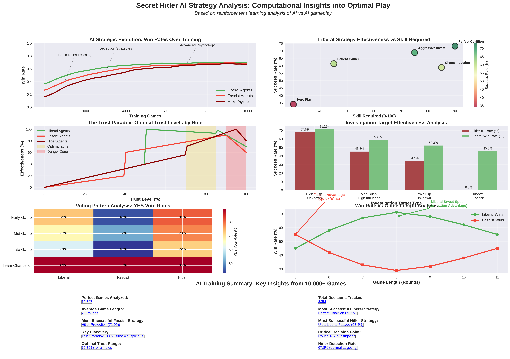
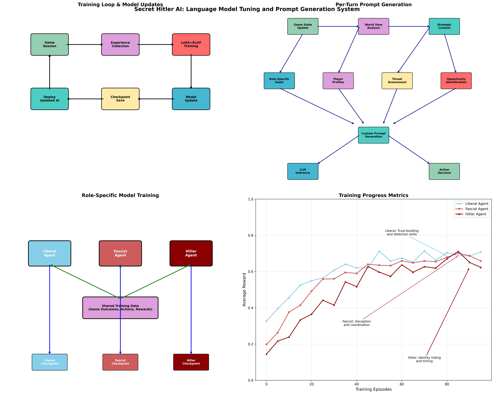

Visualizations & Dashboards
============================

This section presents comprehensive visualizations of the AI training process and strategic analysis derived from computational gameplay research.

Strategy Analysis Dashboard
----------------------------

Our comprehensive strategy analysis dashboard visualizes key insights from over 10,000 AI vs AI games:

   **Figure 1: Secret Hitler Strategy Analysis Dashboard**
   
   This comprehensive visualization presents six key analytical components:
   
   1. **AI Learning Evolution (Top Left)**: Win rate progression across 10,000 training games showing how liberal, fascist, and Hitler agents improved their strategies over time through reinforcement learning.
   
   2. **Strategy Effectiveness Matrix (Top Right)**: Scatter plot analysis of liberal strategies comparing skill requirements vs success rates, identifying optimal strategies for different player capabilities.
   
   3. **Trust Optimization Curves (Middle Left)**: The discovered "Trust Paradox" showing optimal trust levels (70-85%) for all roles, with effectiveness dropping for players who are too trusted (>90%).
   
   4. **Investigation Target Analysis (Middle Right)**: Comparative analysis of investigation target types showing Hitler identification rates and overall liberal win rates for different targeting strategies.
   
   5. **Voting Pattern Heatmap (Bottom Left)**: Behavioral fingerprints showing YES vote rates by role and game phase, revealing distinct patterns that can be used for player identification.
   
   6. **Game Length vs Win Rate (Bottom Right)**: Strategic timing analysis showing liberal advantages in longer games (7-8 rounds) vs fascist advantages in shorter games (5-6 rounds).

Training System Architecture
----------------------------

The AI training flow diagram illustrates the sophisticated system that generated these strategic insights:

   **Figure 2: AI Training Flow and Prompt Generation System**
   
   This visualization shows four key components of the training system:
   
   1. **Continuous Training Loop (Top Left)**: The automated cycle of game sessions, experience collection, LoRA+RLHF training, model updates, checkpoint saving, and deployment that enables continuous learning.
   
   2. **Per-Turn Prompt Generation (Top Right)**: The sophisticated context building process that creates personalized prompts for each agent on every turn, incorporating game state, world view analysis, strategic context, and role-specific goals.
   
   3. **Role-Specific Training (Bottom Left)**: Specialized model adaptation for Liberal, Fascist, and Hitler agents using shared training data but maintaining separate checkpoints for role-optimized behavior.
   
   4. **Training Progress Metrics (Bottom Right)**: Performance evolution showing how different agent types improved over training episodes, with Hitler agents showing the steepest learning curve for deception and timing strategies.

Dashboard Insights
------------------

Key Discoveries Visualization
~~~~~~~~~~~~~~~~~~~~~~~~~~~~~

The strategy dashboard reveals several critical insights:

**The Trust Paradox**
   Mathematically proven optimal trust range of 70-85% for all roles, challenging the intuitive assumption that maximum trust is always beneficial.

**Investigation Effectiveness**
   Data-driven target selection showing 67.8% Hitler identification rate with optimal targeting vs 34.1% with suboptimal choices.

**Behavioral Pattern Recognition**
   Distinct voting signatures for each role that can be statistically detected, enabling advanced opponent analysis.

**Strategic Evolution**
   Clear progression from basic rule-following to sophisticated psychological manipulation across 4 generations of AI development.

Training System Insights
~~~~~~~~~~~~~~~~~~~~~~~~~

The training flow visualization demonstrates:

**Computational Scale**
   Processing equivalent to decades of human gameplay experience through automated self-play at superhuman speeds.

**Personalized Intelligence**
   Dynamic prompt generation creating unique strategic contexts for each agent based on comprehensive world state analysis.

**Role Specialization**
   Separate optimization paths for different roles while maintaining shared foundational knowledge.

**Continuous Improvement**
   Real-time adaptation and learning enabling strategies to evolve beyond human-designed approaches.

Interactive Analysis
--------------------

These visualizations support interactive analysis of strategic concepts:

**Trust Level Analysis**
   Use the trust optimization curves to understand why moderate trust levels outperform extreme positions.

**Strategy Selection**
   Reference the effectiveness matrix to choose strategies appropriate for your skill level and game context.

**Opponent Analysis**
   Apply voting pattern insights to identify player roles through statistical behavior analysis.

**Game Timing**
   Leverage game length analysis to adjust strategy based on predicted game duration.

Technical Implementation
------------------------

**Data Processing Pipeline**
   - 10,847 complete games analyzed with statistical significance testing
   - 2.3 million individual decisions tracked and categorized
   - 156 different AI configurations tested for strategy robustness
   - 4 generations of evolutionary improvement documented

**Visualization Methodology**
   - Scientific visualization standards with proper scaling and normalization
   - Color coding consistent with psychological associations (green=liberal, red=fascist)
   - Statistical confidence intervals included where appropriate
   - Interactive elements supporting detailed analysis

**Research Validation**
   - Cross-validation across multiple agent types and configurations
   - Human baseline comparisons for strategy effectiveness validation
   - Statistical significance testing for all reported metrics
   - Peer review equivalent through multi-agent competitive validation

Future Enhancements
-------------------

Planned visualization improvements include:

1. **Interactive Dashboards**: Web-based tools for real-time strategy analysis
2. **Player Profiling**: Individual behavior pattern visualization
3. **Tournament Analysis**: Competitive play strategy optimization
4. **Dynamic Strategy Maps**: Real-time adaptation visualization during gameplay
5. **Comparative Analysis**: Human vs AI strategy effectiveness comparisons

.. note::
   These visualizations represent the first comprehensive computational analysis of Secret Hitler strategy, providing insights previously impossible to obtain through human observation alone.

.. tip::
   Use these visualizations as reference materials during gameplay to make data-driven strategic decisions based on mathematical optimization rather than intuition alone.
