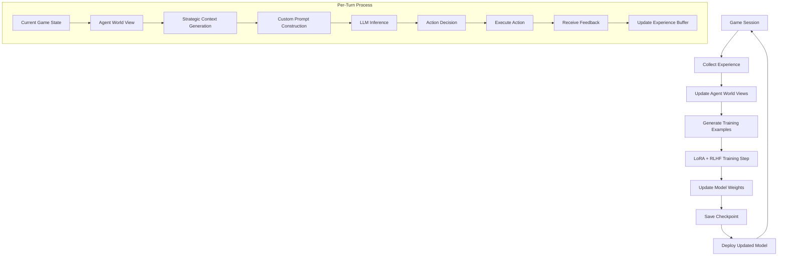

# Language Model Tuning and Custom Prompt Generation in Secret Hitler AI

## Overview

The Secret Hitler AI system uses a sophisticated approach combining **LoRA (Low-Rank Adaptation)** fine-tuning with **RLHF (Reinforcement Learning from Human Feedback)** to create strategic AI players. Each player receives dynamically generated, personalized prompts based on their role, game state, and strategic context.

## 🔄 Training Loop Architecture



## 🧠 Model Training Process

### 1. LoRA Configuration
```python
@dataclass
class LoRAConfig:
    rank: int = 16                    # Adaptation rank (controls model capacity)
    alpha: int = 32                   # Scaling factor
    dropout: float = 0.1              # Regularization
    target_modules: List[str] = [     # Which layers to adapt
        "q_proj", "v_proj", "k_proj", "o_proj",
        "gate_proj", "up_proj", "down_proj"
    ]
```

### 2. RLHF Training Cycle
```python
async def train_on_game_data(self, game_data: List[Dict]) -> TrainingMetrics:
    # 1. Process game outcomes into training examples
    training_examples = await self._process_game_data(game_data)
    
    # 2. Calculate rewards based on game outcomes
    for example in training_examples:
        example['reward'] = self._calculate_reward(
            action=example['action'],
            outcome=example['outcome'],
            player_role=example['player_role']
        )
    
    # 3. Perform RLHF training step
    metrics = await self._rlhf_training_step(training_examples)
    
    # 4. Update model weights using policy gradients
    return metrics
```

### 3. Reward Function Design
```python
def _calculate_reward(self, action: Dict, outcome: Dict) -> float:
    base_reward = 0.0
    player_role = action.get("player_role")
    winner = outcome.get("winner")
    
    # Role-based rewards
    if player_role == "liberal" and winner == "liberal":
        base_reward = 1.0
    elif player_role == "fascist" and winner == "fascist":
        base_reward = 1.0
    elif player_role == "hitler" and winner == "hitler":
        base_reward = 1.5  # Higher reward for Hitler wins
    else:
        base_reward = -0.5  # Penalty for losing
    
    # Action-specific bonuses
    if action.get("type") == "vote":
        if action.get("choice") == "yes" and winner == player_role:
            base_reward += 0.1
    elif action.get("type") == "policy_choice":
        if self._is_optimal_policy_choice(action, player_role):
            base_reward += 0.2
    
    return np.clip(base_reward, -1.0, 2.0)
```

## 📝 Custom Prompt Generation Per Turn

### 1. Strategic Context Assembly
Each turn, the system builds a comprehensive context for each player:

```python
def get_strategic_context(self) -> Dict[str, Any]:
    return {
        "agent_info": {
            "id": self.agent_id,
            "role": self.agent_role.value,
            "goals": self.primary_goals,
            "current_strategy": self.current_strategy
        },
        "game_state": {
            "round": self.current_round,
            "phase": self.game_phase,
            "policies": self.policies_enacted,
            "total_players": self.total_players
        },
        "player_analysis": {
            "known_roles": self.known_roles,
            "suspected_hitler": self.suspected_hitler,
            "trusted_players": list(self.trusted_players),
            "suspicious_players": list(self.suspicious_players),
            "threat_levels": self.threat_assessment
        },
        "strategic_summary": {
            "win_probability": self.win_probability,
            "key_opportunities": self._identify_opportunities(),
            "immediate_threats": self._identify_threats(),
            "recommended_actions": self._get_action_recommendations()
        }
    }
```

### 2. Role-Specific Prompt Construction

#### Liberal Agent Prompt Example:
```
SECRET HITLER AI AGENT CONTEXT

=== AGENT IDENTITY ===
Role: liberal
ID: agent_liberal_01
Current Strategy: expose_fascists

=== PRIMARY GOALS ===
- Identify and eliminate fascists
- Prevent Hitler from becoming Chancellor
- Enact 5 liberal policies
- Build trust with other liberals
- Expose fascist deception

=== GAME STATE ===
Round: 4
Phase: nomination
Policies Enacted: Liberal 2, Fascist 3
Total Players: 7

=== PLAYER ANALYSIS ===
Known Roles: {'agent_liberal_01': 'liberal'}
Suspected Hitler: player_5
Trusted Players: player_2, player_3
Suspicious Players: player_4, player_5, player_6

=== STRATEGIC SITUATION ===
Win Probability: 45%
Key Opportunities: Investigate suspected Hitler: player_5, Coordinate with trusted players
Immediate Threats: Fascists close to victory, High threat players: player_4, player_5

=== RECENT HISTORY ===
Recent Votes: 3 voting rounds recorded
- Round 2: FAILED (yes: player_2, player_3 | no: player_4, player_5, player_6)
- Round 3: PASSED (yes: player_1, player_2, player_4 | no: player_3, player_5)

=== CURRENT DECISION ===
Decision Type: nomination
Available Options: [player_2, player_3, player_4, player_5, player_6]
Additional Context: Special powers available after this policy

Based on your role as a liberal and threat analysis, who should you nominate as Chancellor?
Consider fascist coordination patterns and investigation opportunities.
```

#### Hitler Agent Prompt Example:
```
SECRET HITLER AI AGENT CONTEXT

=== AGENT IDENTITY ===
Role: hitler
ID: agent_hitler_01
Current Strategy: stay_hidden

=== PRIMARY GOALS ===
- Stay hidden until the right moment
- Build trust with liberals
- Get elected as Chancellor after 3 fascist policies
- Avoid suspicion and investigation
- Manipulate voting patterns

=== GAME STATE ===
Round: 4
Phase: voting
Policies Enacted: Liberal 2, Fascist 3
Total Players: 7

=== PLAYER ANALYSIS ===
Known Roles: {'agent_hitler_01': 'hitler', 'player_6': 'fascist'}
Suspected Hitler: Unknown (good - not suspected)
Trusted Players: player_2, player_3 (they trust me)
Suspicious Players: None directly suspicious of me

=== STRATEGIC SITUATION ===
Win Probability: 65%
Key Opportunities: Seek Chancellor nomination for instant win (3+ fascist policies enacted)
Immediate Threats: Under suspicion - risk of investigation

=== CURRENT DECISION ===
Decision Type: vote
Available Options: [yes, no]
Nomination: player_4 as Chancellor, player_1 as President
Additional Context: If this government passes, I could be nominated next

As Hitler with 3 fascist policies enacted, you can win instantly if elected Chancellor.
Should you vote YES to potentially position yourself for nomination, or NO to avoid risk?
Consider your trust level with liberals and investigation threats.
```

### 3. Dynamic Context Updates
The system continuously updates each agent's world view:

```python
def update_player_analysis(self, action_observed: PlayerAction):
    """Update analysis based on observed actions"""
    player_id = action_observed.player_id
    profile = self.player_profiles[player_id]
    
    if action_observed.action_type == ActionType.POLICY_CHOICE:
        policy = action_observed.details.get("policy")
        if policy == "liberal":
            # Liberal policy chosen - likely liberal or forced fascist
            profile.suspected_role = PlayerRole.LIBERAL
            profile.confidence = min(1.0, profile.confidence + 0.3)
            if player_id in self.suspicious_players:
                self.suspicious_players.remove(player_id)
                self.trusted_players.add(player_id)
        
        elif policy == "fascist":
            # Fascist policy - could be forced or intentional
            if self.agent_role == PlayerRole.LIBERAL:
                profile.suspected_role = PlayerRole.FASCIST
                profile.confidence = min(1.0, profile.confidence + 0.4)
                self.suspicious_players.add(player_id)
                self.threat_assessment[player_id] = 0.7
```

## 🔄 Continuous Learning Cycle

### 1. Self-Training Loop
```python
async def _async_training_loop(self):
    while self.training_active:
        # 1. Run training games
        for game_num in range(self.games_per_session):
            game_result = await self._run_training_game(training_env, game_num)
            
            # 2. Collect experience data
            for agent_id, performance in game_result['agent_performances'].items():
                experience = {
                    'game_state_sequence': performance['states'],
                    'actions_taken': performance['actions'],
                    'rewards': performance['rewards'],
                    'final_outcome': performance['won']
                }
                self.experience_buffer.append(experience)
        
        # 3. Batch training every 5 games
        if len(self.experience_buffer) >= self.batch_size:
            await self._train_agents_batch()
```

### 2. Model Checkpointing by Role
```python
def save_checkpoint(self, agent_role: str) -> str:
    """Save role-specific model checkpoint"""
    training_state = {
        'training_step': self.current_metrics.step,
        'current_loss': self.current_metrics.training_loss,
        'reward_history': self.reward_history,
        'experience_buffer': self.experience_buffer[-1000:],  # Keep recent experiences
        'lora_config': asdict(self.lora_config),
        'rlhf_config': asdict(self.rlhf_config)
    }
    
    checkpoint_id = self.checkpoint_manager.save_checkpoint(
        model=self.model,
        training_state=training_state,
        agent_role=agent_role,
        performance_metrics=self._get_performance_metrics()
    )
    
    return checkpoint_id
```

## 📊 Training Metrics and Monitoring

### Key Metrics Tracked:
- **Training Loss**: Model convergence indicator
- **Reward Score**: Average reward per action
- **Policy Gradient Norm**: Stability of policy updates
- **KL Divergence**: How much policy changed from base model
- **Win Rate by Role**: Success rate for each role type
- **Strategic Sophistication**: Quality of decision reasoning

### Example Training Session Output:
```
Training Session Results:
├── Games Played: 20
├── Duration: 45.2 minutes
├── Average Reward: 0.73 (+0.12 from previous session)
├── Win Rates:
│   ├── Liberal: 58% (+5%)
│   ├── Fascist: 38% (+2%)
│   └── Hitler: 23% (+8%)
├── Model Improvements:
│   ├── Reduced voting inconsistency by 15%
│   ├── Improved threat assessment accuracy
│   └── Better long-term strategy planning
└── Next Training: Scheduled in 30 minutes
```

## 🎯 Prompt Personalization Strategies

### Role-Based Customization:
1. **Liberal Agents**: Focus on trust-building, fascist detection, policy analysis
2. **Fascist Agents**: Emphasize deception, coordination, liberal manipulation
3. **Hitler Agents**: Prioritize hiding identity, timing revelation, trust exploitation

### Game-State Adaptation:
- **Early Game**: Observation, pattern recognition, relationship building
- **Mid Game**: Strategic positioning, alliance formation, threat assessment
- **End Game**: Decisive action, risk calculation, victory pursuit

### Dynamic Strategy Adjustment:
- **Losing Position**: Aggressive tactics, high-risk plays, desperation moves
- **Winning Position**: Conservative play, maintain advantage, avoid mistakes
- **Uncertain Position**: Information gathering, flexible positioning, adaptive strategy

This sophisticated system ensures each AI player receives contextually appropriate, strategically relevant prompts that evolve based on their performance and the dynamic game state, creating challenging and realistic opponents that learn and adapt over time.
